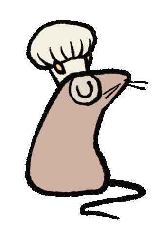
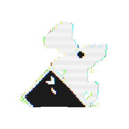

<!-- new_lines: 2 -->




<!-- column_layout: [1, 2, 1] -->

<!-- column: 1 -->

#### <span style="color: #ffffff">**Welcome to the workshop!**</span>

<!-- reset_layout -->

<!-- column_layout: [1, 9] -->

<!-- column: 1 -->

[](https://github.com/orhun/rustasia2025-ratatui-workshop)

<!-- end_slide -->

<!-- column_layout: [4, 5] -->

<!-- column: 0 -->

<!-- new_lines: 1 -->


<!-- column: 1 -->

<!-- new_lines: 1 -->

<!-- pause -->

# **Orhun Parmaksız**

🦀 Open source, Rust and terminals!

🐭 **Ratatui**, **Ratzilla**, **git-cliff**, **binsider**

📦 **Arch Linux** (btw)

---

`https://orhun.dev             `

`https://github.com/orhun      `

`https://youtube.com/@orhundev `

<!-- end_slide -->

# About the workshop

<!-- pause -->

<!-- column_layout: [3, 2] -->

<!-- column: 1 -->



<!-- column: 0 -->

## Goals

- Get started with Rust & Ratatui
- Grasp the terminal UI concepts
- Build a real-world application

<!-- pause -->

## Structure

- 2 hours in total
- Split up into 5 chapters
- Hands-on coding

<!-- end_slide -->

# What are we gonna cook?

```bash +exec +acquire_terminal
cargo run
```

<!-- end_slide -->

# Schedule

| Duration | Chapter       | Topic                                                    |
| -------- | ------------- | -------------------------------------------------------- |
| **20m**  | **Chapter 1** | **Setup** - Install Rust, cargo-generate, create project |
| **25m**  | **Chapter 2** | **Layout & Styling** - Define UI structure, apply styles |
| **15m**  | **Chapter 3** | **Manage State** - Use `sysinfo`, refresh data           |
| **40m**  | **Chapter 4** | **Widgets** - Render charts, bar charts, sparklines      |
| **20m**  | **Chapter 5** | **Interactivity** - Handle inputs, scroll table, search  |
| **-**    | 🧀            | **Q&A / Extras**                                         |

<!-- end_slide -->

# Chapter 1 - Setup 🧀

<!-- column_layout: [1, 1] -->

<!-- column: 0 -->

## Objectives

• Install Rust using `rustup.rs` or any other way

• Install `cargo-generate`

• Generate a new Ratatui project

```bash
$ cargo generate ratatui/templates
```

<!-- column: 1 -->

## Bonus track

• Change the text

• Change the colors

<!-- end_slide -->

# Chapter 2 - Layout & styling 🧀

<!-- column_layout: [1, 1] -->

<!-- column: 0 -->

## Objectives

• Lay out the main application blocks

• CPU, Disks, Memory, Network, Processes

• Add style to the titles

<!-- column: 1 -->

## Bonus track

• Refactor each block into its own function

<!-- end_slide -->

# Chapter 3 - Manage state 🧀

<!-- column_layout: [1, 1] -->

<!-- column: 0 -->

## Objectives

• Add `sysinfo` dependency

• Store `System` struct

• Refresh the data every 100ms

<!-- column: 1 -->

## Bonus track

• Create `update` method

<!-- end_slide -->

# Chapter 4 - Widgets 🧀

<!-- column_layout: [1, 1] -->

<!-- column: 0 -->

## Objectives

• Store CPU data in app state

• Render a `Chart` widget

<!-- column: 1 -->

## Bonus track

• Render memory (`Chart`)

• Render disks (`BarChart`)

• Render network (`Sparkline`)

<!-- end_slide -->

# Chapter 5 - Interactivity 🧀

<!-- column_layout: [1, 1] -->

<!-- column: 0 -->

## Objectives

• Store processes data in app state

• Render a `Table` widget

• Scroll the table when J/K pressed

<!-- column: 1 -->

## Bonus track

• Support searching via `tui-input`

<!-- end_slide -->

# Show and tell!


